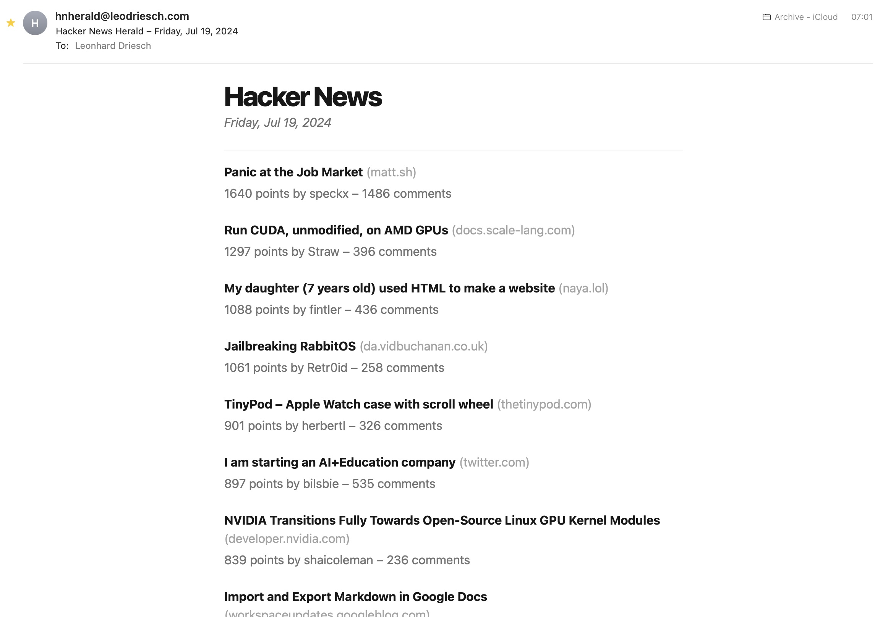

    
    <h1>Hacker News Herald</h1>
    

        <strong>Sends a copy of the most upvoted recent posts from Hacker News as an email. Has to be deployed as a CRON job.</strong>
    

  

When the script is run, it fetches the 30 best stories from https://news.ycombinator.com/best and composes a nicely styled email out of it.

The email address to send to is hardcoded in [main.tsx](https://github.com/leodr/hacker-news-herald/blob/main/main.tsx), and has to be adjusted. Also `RESEND_API_KEY` has to be an environment variable that contains an API key for [resend.com](https://resend.com/).

 

## Screenshots

## Development

1. **Requirements**

   You need [Node.js](https://nodejs.org/en/) installed on your system.

2. **Install packages**

   Run `npm install` to install all neccesary packages.

3. **Run the application**

   Start the script by running `npm start`.
